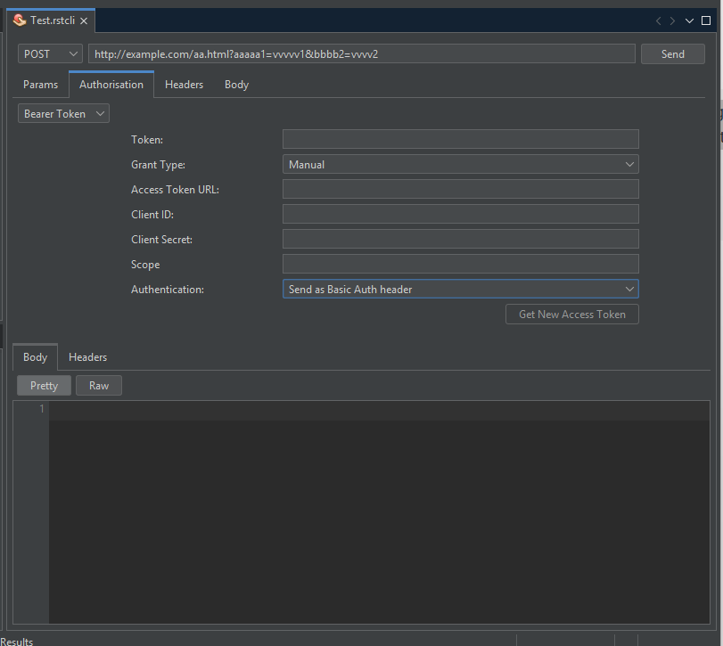
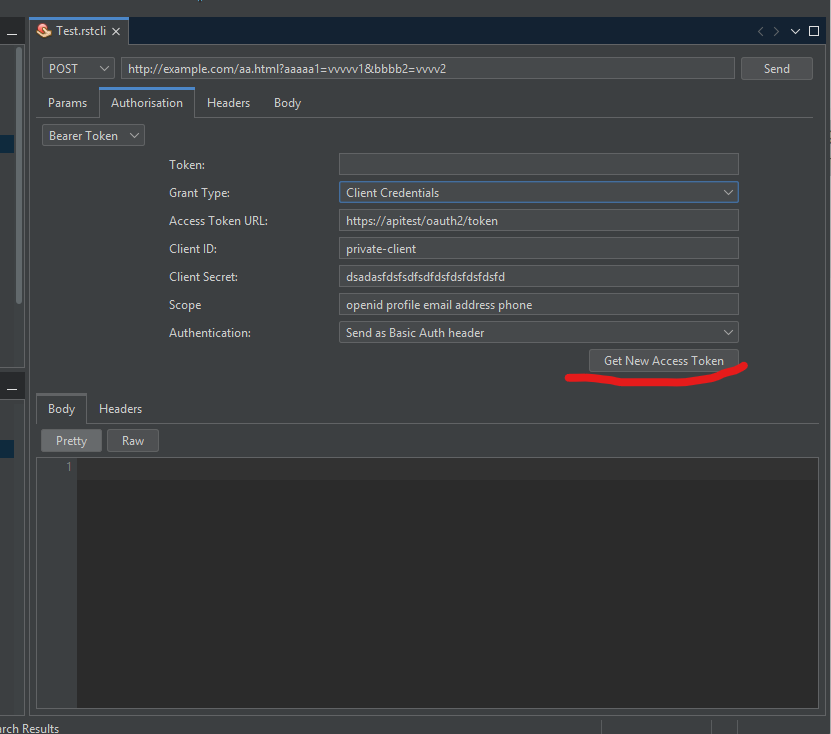
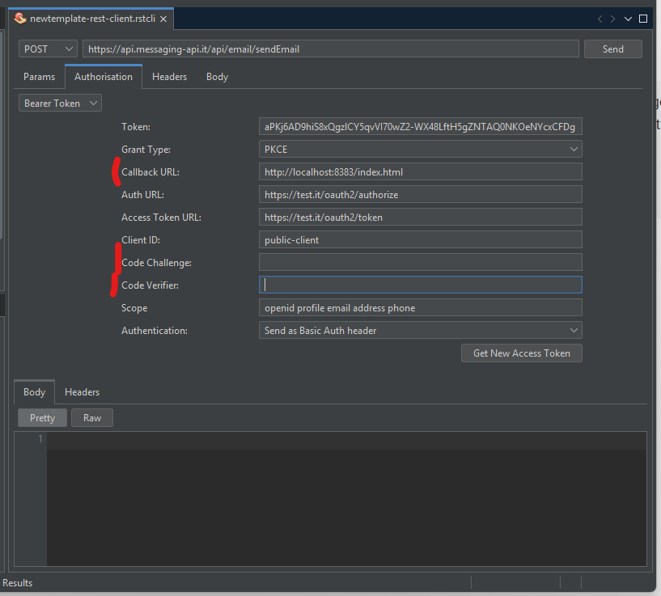

# netbeans-rest-client-2
A REST client for NetBeans

Features
- Sending GET, POST, PUT, PATCH or DELETE requests
- Authorisation: Basic Auth and Bearer Token entered manually or through OAuth 2.0 Client Credential o Authorization Code with PKCE
- Adding headers
- Adding body (text, JSON or XML)
- Displaying response headers
- Making JSON, XML or HTML response pretty/ugly
- Opening links of a JSON/XML response in a new tab
- Importing from/exporting to Postman collections

Instructions
- Install the module (Tools -> Plugins -> Available Plugins)
- Then right click in a folder or package go to other and select Rest Client, a file will be created to save the settings and the UI for managing the Rest Request will open

Enter the token manually.

Retrieving the token via Client Credentials call

Retrieving the token via Authorization Code with PKCE; the Callback URL, Code Challenge, and Code Verifier fields are automatically created if not passed. If passed, the Callback URL must always be on localhost and on an unused port because the plugin opens a server listening on that port and address to capture the token sent to it from the login page.
